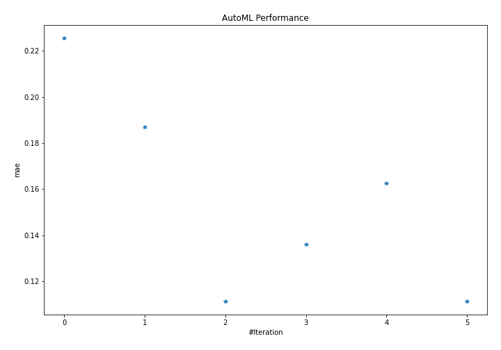
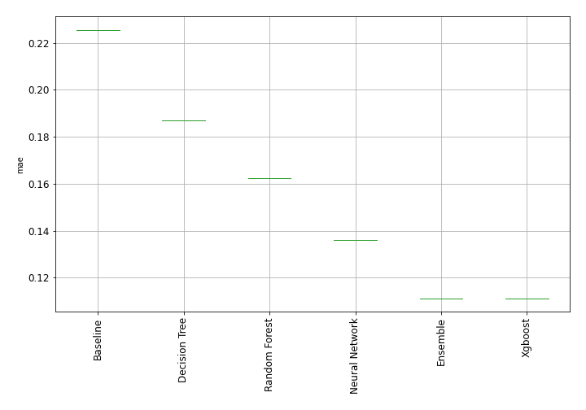
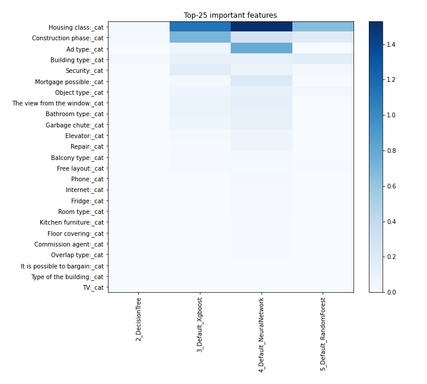
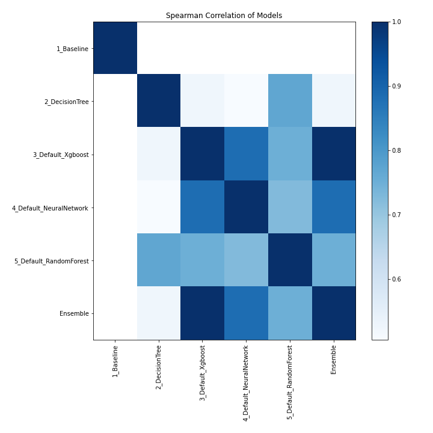

## Checking possibilities of AutoML package from MLJAR
### based on the https://github.com/mljar/mljar-supervised
---

If someone is looking for ready to use/easy to install( here on lubuntu) automatised ml package for analysis of tabular data 
this is an excellent choice.  I am really impressed by way of presenting and storage results by package.  
To check and play input data with Moskow flat prices were used.   Typical example for regresion to evaluate the price
metric mae.

[mljar.ipynb](mljar.ipynb)

### Below there is starting screen of leaderboard with reasults generated by package:

---

### AutoML Leaderboard

| Best model   | name                                                         | model_type     | metric_type   |   metric_value |   train_time |
|:-------------|:-------------------------------------------------------------|:---------------|:--------------|---------------:|-------------:|
|              | [1_Baseline](1_Baseline/README.md)                           | Baseline       | mae           |       0.225592 |         2.68 |
|              | [2_DecisionTree](2_DecisionTree/README.md)                   | Decision Tree  | mae           |       0.186864 |        21.44 |
| **the best** | [3_Default_Xgboost](3_Default_Xgboost/README.md)             | Xgboost        | mae           |       0.111216 |        29.3  |
|              | [4_Default_NeuralNetwork](4_Default_NeuralNetwork/README.md) | Neural Network | mae           |       0.136117 |         9.68 |
|              | [5_Default_RandomForest](5_Default_RandomForest/README.md)   | Random Forest  | mae           |       0.16243  |        39.82 |
|              | [Ensemble](Ensemble/README.md)                               | Ensemble       | mae           |       0.111216 |         1.53 |

### AutoML Performance

### AutoML Performance Boxplot

### Features Importance

### Spearman Correlation of Models

